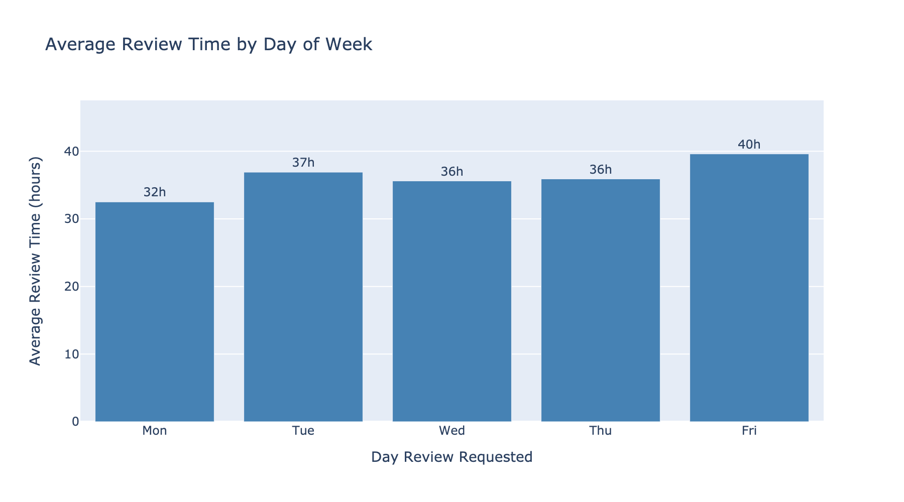

# Baseline System Productivity Report

## Executive Summary

- Key findings
- Overall productivity baseline
- Top opportunities for improvement
- Top wins/strengths

## Introduction & Methodology

### Purpose

- Understand how to measure engineering productivity
- Establish a productivity baseline
- Enable future ROI evaluation of investments (AI adoption, hiring, etc.)

### Scope

- Areas/Tribes/Squads covered
- Time period

### Metrics Philosophy

This report uses metrics *about* teams rather than metrics *for* teams.

**Metrics for teams** are used by teams themselves to improve - they show up in retrospectives, inform working agreements, and help teams spot their own bottlenecks.

**Metrics about teams** give engineering leaders organizational visibility. They work best in aggregate, showing patterns across multiple teams or tracking progress on company-level goals.

This report focuses on the latter. The goal is transparency about organizational health, not surveillance of individuals or teams.

### Data Sources

- Swarmia
- [Others TBD]

## PR Throughput

> A high-level proxy for engineering output volume.

### Raw vs Normalized Throughput

**Key takeaway**: Raw throughput has nearly doubled in 2 years, but per-contributor throughput is flat. Growth is from hiring, not increased individual productivity.

| Metric | Jan 2024 | Jan 2025 | Jan 2026 | YoY Change |
|--------|----------|----------|----------|------------|
| PRs merged | 5,679 | 8,171 | 10,076 | +23% |
| Contributors | ~300 | ~415 | 564 | +36% |
| PRs/contributor | ~19 | ~20 | ~18 | -13% |

### Comparison by Area

Throughput per contributor varies by area due to various reasons including nature of work and domain.

*Note: Shows average monthly PRs per contributor over the last 6 months. Error bars show month-to-month variation (standard deviation).*

### Insights

1. **Growth is from hiring** - We're shipping more because we have more people, not because individuals are faster.

2. **AI impact not visible here** - Despite AI adoption, per-person throughput hasn't increased. Value may show up elsewhere (cycle time, code quality, onboarding).

3. **Questions for further investigation**:
   - Are PRs getting larger (more code per PR)?
   - Is cycle time improving?
   - Where is AI-saved time being reallocated?

### Throughput vs Batch Size

> Do areas with lower throughput ship larger PRs? If so, comparing raw PR counts may be misleading.

*TODO: Correlate PRs/contributor with average PR size by area. Some areas may ship fewer but larger changes.*

*Analysis: `notebooks/pr_throughput.ipynb`*

## Understanding Where Work Gets Stuck

### Cycle Time

> The total time a pull request spends in all stages of the development pipeline. Similar to change lead time but doesn't include time to deploy.

Cycle time is the sum of three components:

- **Time in progress** — from the first commit (or PR opened) to the first review request
- **Time in review** — from the first review request to final approval
- **Time to merge** — from final approval to merged

### 12-Month Baseline

*Benchmarks: Great < 24 hours, Good < 5 days, Needs Attention ≥ 5 days*

| Metric | Value | Benchmark |
|--------|-------|-----------|
| Average cycle time | 2.9 days | Good |
| Median cycle time | ~1 hour | Great |

Average cycle time is ~3 days, but median is under 1 hour. The typical PR (median) is in the "Great" tier—but outliers pull the average down to "Good".

| Speed Category | % of PRs | Avg Cycle Time |
|----------------|----------|----------------|
| Fast (≤1 day) | 74% | 3 hours |
| Normal (1-7 days) | 17% | 3.3 days |
| Slow (1-2 weeks) | 4% | 10 days |
| Outlier (>2 weeks) | 5% | 37 days |

### Trend

Cycle time has remained stable despite the team nearly doubling in 2 years. We've scaled without slowing down.

### Cycle Time Breakdown

> Breaking cycle time into stages reveals exactly where work gets stuck.

| Phase | Average Hours | % of Total |
|-------|---------------|------------|
| Progress (coding) | 31h (1.3d) | 37% |
| Review | 40h (1.7d) | 47% |
| Merge | 14h | 17% |
| **Total** | **85h (3.5d)** | 100% |

**Key insight**: Review is the biggest phase at 47% of cycle time. This includes both waiting time (for first review, for re-reviews) and actual review work. Given that time to first review alone averages 17 hours, a significant portion of this phase is waiting, not active feedback.

### Review Time Deep Dive

Average review time is ~40h (1.7 days), median is ~1 hour. Like cycle time, outliers pull up the average.

**Trend**: Review time has been declining over the past year. This may be related to AI-assisted review tools we've been investing in—worth investigating further in the AI section.

**Waiting vs Iteration**: Of the 40h average, 42% is waiting for first review (~17h) and 58% is actual review iteration (~23h). Review time isn't purely a "waiting" problem—most of it is legitimate back-and-forth.

#### By Area

Player takes 3.5x longer than Data in review.

#### By Day of Week

PRs requested on Friday take longer—they sit over the weekend.

### What Makes Outliers Different?

Outliers aren't stuck in review—they're stuck in progress. Fast PRs spend most of their time waiting for review (60%). Outliers spend nearly half their time in the coding phase itself (46%).

#### Understanding Outliers Better

> We know outliers are bigger PRs stuck in progress. But why are they big? What can we do about it?

*TODO: Deeper analysis to understand outlier patterns:*
- *By team/area: Which teams have the highest outlier rates?*
- *By work type: Are outliers features, refactors, migrations, or bug fixes?*
- *By author tenure: Do new joiners create more outliers?*
- *By repo/codebase: Are certain parts of the codebase prone to large PRs?*
- *Cost analysis: How much eng-time is tied up in outliers?*

### Batch Size (PR Size)

Two-thirds of PRs are small (≤50 lines). 12% are large (>400 lines).

Larger PRs take longer—XL PRs (>400 lines) average 8.6 days vs 1.6 days for XS (≤50 lines). This connects the dots: outliers are stuck in progress because they're bigger.

### Build Time and CI Feedback Speed

> If your CI pipeline takes 30 minutes and developers run it 5 times a day, that's 2.5 hours of waiting per person per day.

*Data not yet available - requires CI/CD pipeline instrumentation.*

### Insights

1. **Most PRs are fast** - 74% merge within a day, 66% complete review in <4 hours. The "typical developer experience" is quick iteration.

2. **Outliers drive the average** - 5% of PRs take >2 weeks and account for most of the average cycle time. Reducing outliers would have outsized impact.

3. **Outliers are bigger, not stuck differently** - They're 7x larger and slow in every phase. This suggests the fix is smaller PRs, not process changes.

4. **Review time is 38% waiting, 62% iteration** - Review isn't purely a "pickup" problem. Most review time is legitimate back-and-forth, though the 15h average wait for first review is still significant.

5. **PR size is the biggest lever** - Large PRs take 4.5x longer in review and 2.5x longer overall. Two-thirds of PRs are already small (≤50 lines) - the opportunity is converting the 11% that are XL.

6. **Friday effect is real** - PRs requested on Friday take 60% longer (50h vs 31h). Consider not requesting reviews late Friday.

7. **Area variation is significant** - Player takes 3.5x longer than Data in review (63h vs 18h). Worth investigating what Data does differently.

*Analysis: `notebooks/cycle_time.ipynb`*

## Software Delivery Performance

> DORA metrics provide the clearest picture of an organization's delivery capability and stability. This baseline covers **throughput** metrics (deployment frequency and time to deploy). Stability metrics (change fail rate, recovery time) are out of scope for this initial baseline.

### Areas Covered

This section covers **Player, Sports, Social, and Platform**, the four areas where we can reliably identify production deployments in Swarmia today.

| Area | What's Included |
|------|-----------------|
| Player | Production app deployments |
| Sports | Monorepo deployments (~70% of services) |
| Social | Backend production deployments |
| Platform | Monorepo deployments (tools & infrastructure) |

**Not included**: Core Experience, Data, and Gaming don't have consistent deployment tracking yet. They're included in PR-based metrics (throughput, cycle time) but excluded here. We're working on getting their deployment data and should have it soon.

### Deployment Frequency

> How often teams can ship to production. This is a proxy for delivery capability - elite teams can deploy whenever they need to.

**Key takeaway**: Most teams deploy weekly or less. No teams have achieved daily deployment capability yet.

Half of teams deploy less than weekly. No teams have achieved daily deployment capability yet, though 3 teams (12%) deploy 2-3x per week.

#### By Area

Deployment frequency varies significantly by area. Platform has the highest concentration of high-frequency deployers - this aligns with their faster Time to Deploy metrics.

*Based on teams in tracked areas (Player, Sports, Social, Platform) with ≥3 deploy days in last 3 months.*

**Top performers**: Transact (54%), Release Engineering (49%), App Frameworks (42%) - these teams can deploy 2-3x per week.

### Time to Deploy

> Time from **PR merged** to **deployed in production**. This measures deployment pipeline speed - how long does merged code wait before reaching users?

**Key takeaway**: Median TTD is ~3 days (Moderate tier). The average is 3.6x higher due to outliers - a small percentage of deployments take weeks.

| Metric | 6-Month Baseline |
|--------|------------------|
| Median TTD | 70h (2.9d) |
| Average TTD | 253h (10.6d) |
| P90 TTD | 579h (24d) |
| **Performance Tier** | **Moderate** |

*Using stricter DORA benchmarks: Elite <1h, Fast <1d, Moderate <1wk, Slow >1wk*

#### Distribution

| Tier | % of Deployments |
|------|------------------|
| Elite (<1 hour) | 13% |
| Fast (<1 day) | 25% |
| Moderate (<1 week) | 28% |
| Slow (>1 week) | 35% |

**37% of deployments ship within a day of merge** - these represent healthy CI/CD pipelines. The 35% taking over a week are pulling up the average significantly.

#### By Area

| Area | Median TTD | Tier | Gap to Next Tier |
|------|------------|------|------------------|
| Platform | 12.6h | Fast | 11.6h to Elite |
| Sports | 53.3h (2.2d) | Moderate | 29.3h (1.2d) to Fast |
| Player | 85.8h (3.6d) | Moderate | 61.8h (2.6d) to Fast |
| Social | 168.2h (7.0d) | Slow | 0.2h to Moderate |

**Platform is the fastest** at 12.6h median - solidly in the Fast tier. **Social is the slowest** at 7 days - right at the Slow threshold.

### What Drives TTD?

| Factor | Finding |
|--------|---------|
| **Batch Size** | Bundling multiple PRs correlates with slower deploys |
| **Deployment Size** | Larger code changes take longer to deploy |

Most deployments are single-PR, and these deploy faster than multi-PR batches.

#### By Change Type

> Do bug fixes deploy faster than new features? Understanding TTD by change type could reveal whether urgency or complexity drives deployment speed.

*TODO: Categorize deployments by type (bug fix, feature, refactor, etc.) if PR labels or commit conventions allow. Analyze TTD differences.*

### Insights

1. **No teams at elite cadence** - Even top performers deploy 2-3x/week, not daily. This suggests deployment processes still have friction.

2. **37% of deploys are fast, 35% are slow** - There's a bimodal distribution. Some pipelines work well; others have significant delays.

3. **Platform leads, Social lags** - 13x difference in median TTD between fastest and slowest areas. Worth investigating what Platform does differently.

4. **Smaller batches = faster deploys** - Single-PR deployments are faster. Teams batching multiple PRs may be working around deployment friction rather than fixing it.

5. **Gap to next tier is achievable** - Most areas need to shave 1-3 days off median TTD to reach the next performance tier.

### Out of Scope

The following stability metrics are not included in this baseline:
- **Change Fail Rate** - % of deployments causing incidents
- **Failed Deployment Recovery Time** - Time to recover from deployment failures
- **Deployment Rework Rate** - % of unplanned/reactive deployments

These require incident data integration and will be added in a future iteration.

*Analysis: `notebooks/software_delivery.ipynb`*

## Understanding Where Engineering Effort Goes

> These metrics help make informed decisions about resource allocation and have data-informed conversations about engineering capacity.

### Investment Balance

> The percentage of time spent on: new things, improvements, productivity, and keeping the lights on.
>
> **What it tells you**: Without visibility here, you'll assume most engineering time goes toward building new things. The reality is often different - many teams spend 40-50% on maintenance and unplanned work. If your roadmap assumes 80% feature capacity and reality is 50%, you'll keep missing commitments.

- Baseline: % New features vs Improvements vs Maintenance vs Unplanned
- Comparison by Area/Tribe
- Trend over time
- Insights

### Planning Accuracy

> What teams planned to ship versus what actually shipped.
>
> **What it tells you**: Matters at scale when predictability becomes important for coordinating across teams. Consistently low accuracy suggests problems with estimation, scope creep, or interruptions. Consistently high accuracy might mean teams are being too conservative.

- Baseline & Trend
- Comparison (Area/Tribe/Squad)
- Insights

## Developer Experience

> Numbers tell you what's happening, but not why. Developer experience directly impacts both productivity and retention.

- Survey results (if available)
- Key themes
- Comparison by Area/Tribe

## Measuring the Impact of AI Coding Tools

> If teams are using AI coding assistants, resist the urge to find a single "AI productivity KPI." What works better is examining existing metrics with an AI lens.
>
> **Important caveat**: If AI-assisted PRs have shorter cycle times, that might mean AI genuinely helps, OR your most experienced engineers are the keenest adopters, OR teams with strong fundamentals are both faster and more likely to experiment. Each explanation suggests different actions.

- Adoption rates by Area/Tribe/Squad
- Adoption overlays
- Metrics comparison: AI-assisted vs non-AI-assisted
  - Cycle time
  - Batch size
  - Time in review
- Survey results (CSAT, self reported time savings, time saved on non-dev tasks, friction)
- Key findings (with appropriate caveats)
- Hypotheses to test
    - Major model improvements lead to step-change improvements (e.g. Opus 4.5)
        - More adoption
        - More productivity
    - Broad, supported adoption on Claude (vs before: shadow AI on fragmented, less capable tools)
    - Impact of workshops on adoption & productivity
        - More adoption after workshops
        - People in workshops have higher throughput? ("workshop effect")
    - Correlating throughput with AI adoption
    - No longer have this effect where people try and stop using (usage sticks)
    - Product is starting to write more code
    - Is the proportion of employees merging code increasing with AI?
    - Throughput is dramatically increasing (throughput with AI adoption overlay)
    - People are onboarding faster(?) -> not sure how to measure.. Onboarding survey?
    - We can service more demand (e.g. investment balances)
    - We are not paying a big quality price (review time, batch size, WIP)
    - PR throughput vs commits - are we pushing more directly?
    - How does PR throughput compare to batch sizes
    - Are we becoming more or less dependent on key contributors?
        - Is AI: democratizing output (more people contributing meaningfully) *or* amplifying existing patterns (top contributors just do even more)
        - Gini coefficient of PR distribution or % of PRs from top 10% contributors over time
    - Show cost: spending X amount per hour saved on review time

## Comparative Scorecard

> Summary view across organizational units.

- Area-by-area summary table
- Tribe-by-tribe summary table
- Pain points by team
- Top performers

## Recommendations & Next Steps

### Dashboards

This report provides a point-in-time baseline, but productivity measurement is an ongoing practice. We will create dashboards that mirror the structure of this report, allowing teams and leaders to:

- **Track trends over time**: See how metrics evolve week-over-week, month-over-month
- **Self-serve exploration**: Filter by Area, Tribe, or Squad without waiting for a new report
- **Compare against baseline**: Understand whether investments are moving the needle
- **Enable transparency**: Teams can see the same data leadership sees, reinforcing that metrics are for organizational health, not surveillance

The dashboards serve as the **data layer** while this report serves as the **narrative layer** - one source of truth, multiple ways to consume it.

## Appendix

- Data definitions
- Methodology details
