# Productivity & AI Impact Report

# Executive Summary

> **WIP**

- Key findings
- Overall productivity baseline
- Top opportunities for improvement
- Top wins/strengths

# Introduction & Methodology

## Purpose

- Understand how to measure engineering productivity
- Establish a productivity baseline
- Enable ROI evaluation of investments (specifically AI adoption, but also hiring, etc.)
- Inform platform investment priorities based on cross-area needs

## Metrics Philosophy

This report uses metrics *about* teams rather than metrics *for* teams.

**Metrics for teams** are used by teams themselves to improve - they show up in retrospectives, inform working agreements, and help teams spot their own bottlenecks.

**Metrics about teams** give engineering leaders organizational visibility. They work best in aggregate, showing patterns across multiple teams or tracking progress on company-level goals.

This report focuses on the latter. The goal is transparency about organizational health, not surveillance of individuals or teams.

# PR Throughput

> A high-level proxy for engineering output volume.

## Raw vs Normalized Throughput

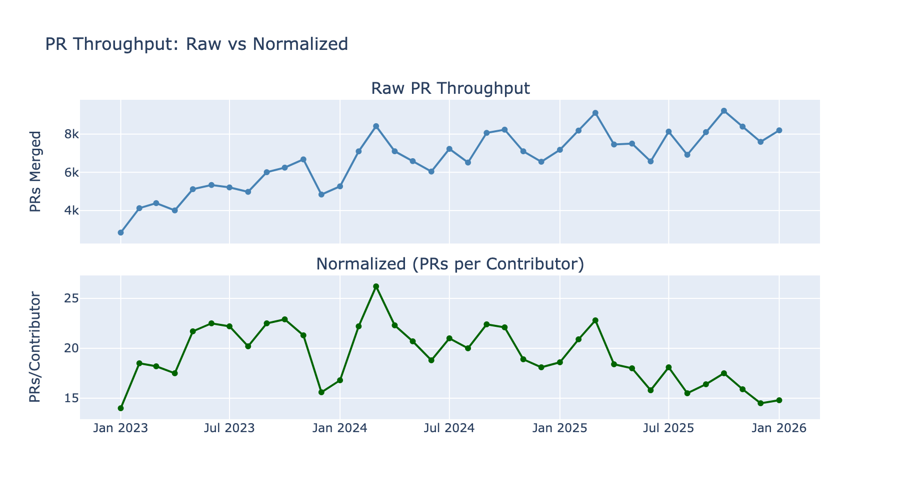

**Key takeaway**: Raw throughput is growing (+23% YoY), but per-contributor throughput is flat. Growth is from hiring, not increased individual productivity.

| Metric | Jan 2024 | Jan 2025 | Jan 2026 | YoY Change |
| --- | --- | --- | --- | --- |
| PRs merged | 5,679 | 8,171 | 10,076 | +23% |
| Contributors | ~300 | ~415 | 564 | +36% |
| PRs/contributor | ~19 | ~20 | ~18 | -13% |

*Todo: look at PR sizes. We might not be shipping more PRs, but they could be bigger. Look at PR count by size bucket over time.*

## Comparison by Area

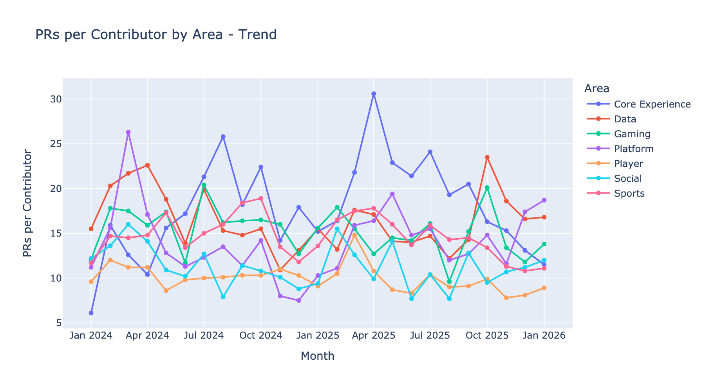

Throughput per contributor varies by area due to various reasons including nature of work and domain.

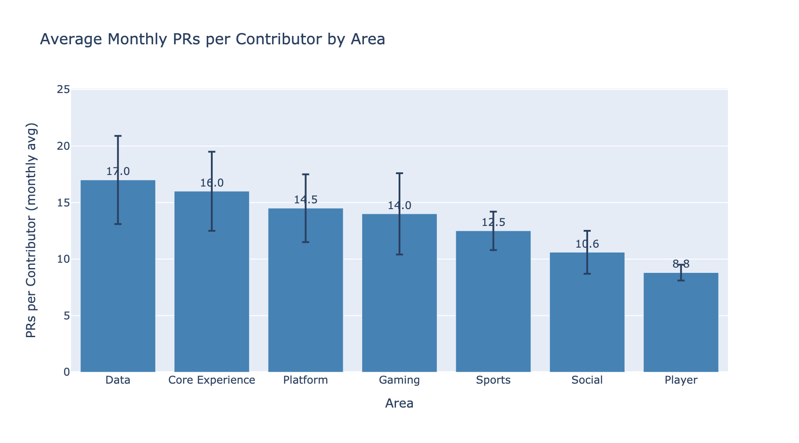

*Note: Shows average monthly PRs per contributor over the last 6 months. Error bars show month-to-month variation (standard deviation).*

## Insights

1. **Growth is from hiring** - We're shipping more because we have more people, not because individuals write more PRs.
2. **AI impact not visible here** - Despite AI adoption, per-person throughput hasn't increased. Value may show up elsewhere (cycle time, code quality, onboarding).
3. **Questions for further investigation**:
    - Are PRs getting larger (more code per PR)?
    - Is cycle time improving?
    - Where is AI-saved time being reallocated?

*Analysis: `notebooks/pr_throughput.ipynb`*

# Understanding Where Work Gets Stuck

## Cycle Time

> The total time a pull request spends in all stages of the development pipeline. Similar to change lead time but doesn't include time to deploy.

Cycle time is the sum of three components:

- **Time in progress** — from the first commit (or PR opened) to the first review request
- **Time in review** — from the first review request to final approval
- **Time to merge** — from final approval to merged

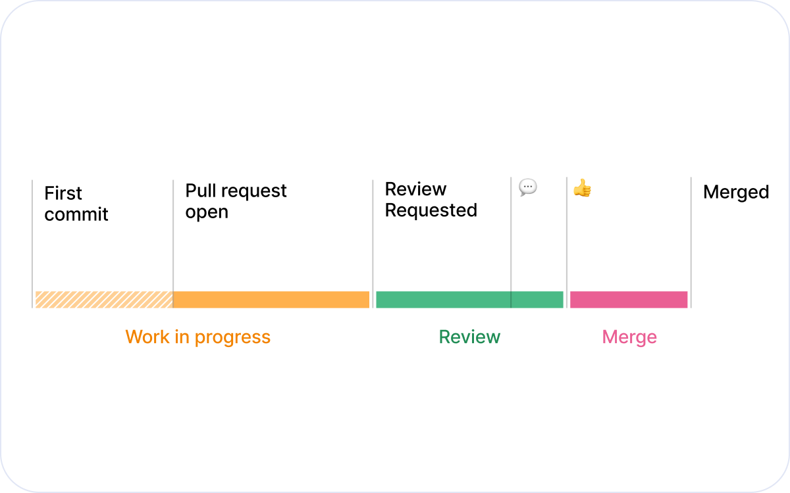

### 12-month baseline

*Benchmarks: Great < 24 hours, Good < 5 days, Needs Attention ≥ 5 days*

| Metric | Value | Benchmark |
| --- | --- | --- |
| Average cycle time | 2.9 days | Good |
| Median cycle time | ~1 hour | Great |

Average cycle time is ~3 days, but median is under 1 hour. The typical PR (median) is in the "Great" tier, but outliers pull the average down to "Good".

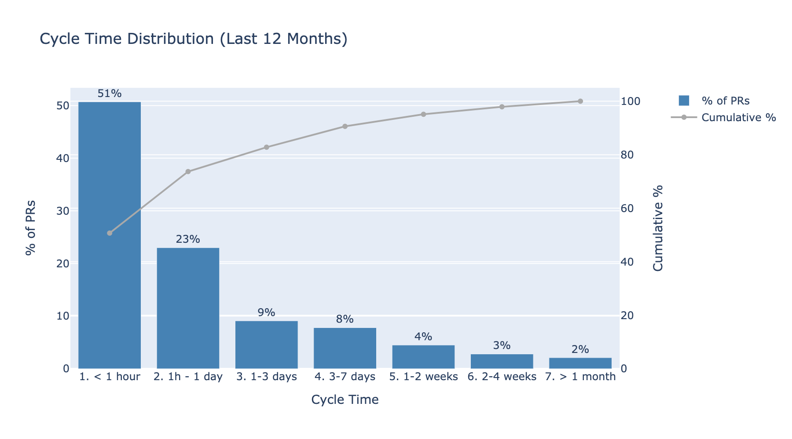

| Speed Category | % of PRs | Avg Cycle Time |
| --- | --- | --- |
| Fast (≤1 day) | 74% | 3 hours |
| Normal (1-7 days) | 17% | 3.3 days |
| Slow (1-2 weeks) | 4% | 10 days |
| Outlier (>2 weeks) | 5% | 37 days |

Most PRs (74%) merge within a day. That's the typical developer experience. The 5% that take >2 weeks are the outliers pulling the average up from ~1 hour to ~3 days.

### Trend

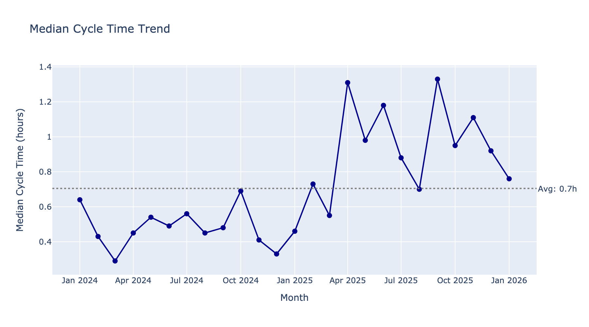

Cycle time has remained stable despite the team nearly doubling in 2 years. We've scaled without slowing down.

**By Area**

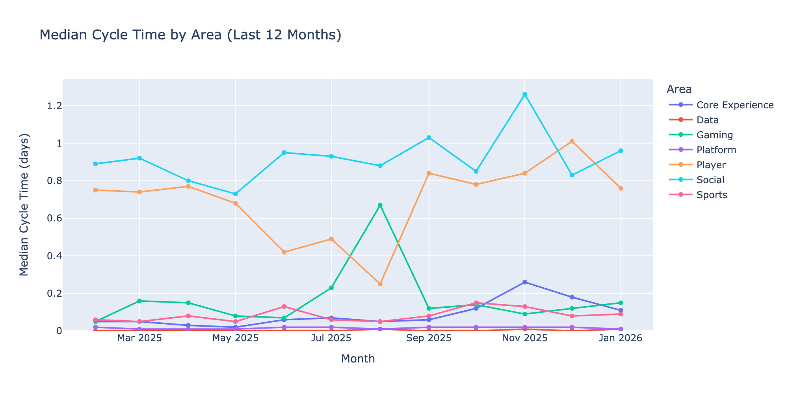

### Cycle Time Breakdown

> Breaking cycle time into stages reveals exactly where work gets stuck.

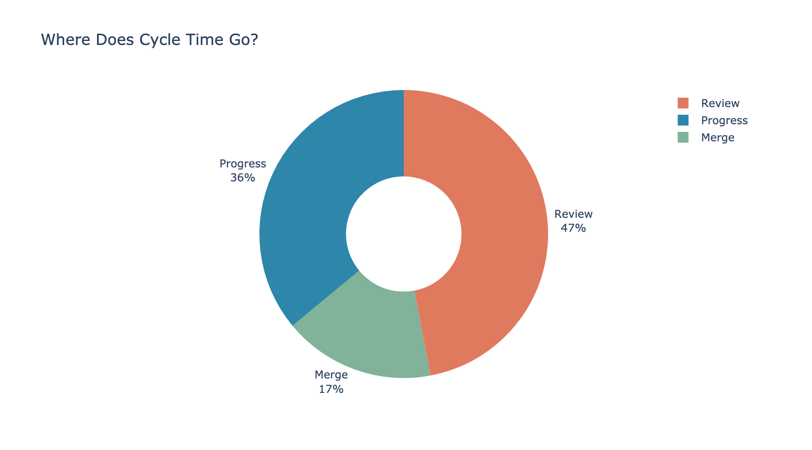

| Phase | Average Hours | % of Total |
| --- | --- | --- |
| Progress (coding) | 31h (1.3d) | 37% |
| Review | 40h (1.7d) | 47% |
| Merge | 14h | 17% |
| **Total** | **85h (3.5d)** | 100% |

Review is the biggest phase at 47% of cycle time. This includes both waiting time (for first review, for re-reviews) and actual review work. Given that time to first review alone averages 17 hours, a significant portion of this phase is waiting, not active feedback.

### Review Time Deep Dive

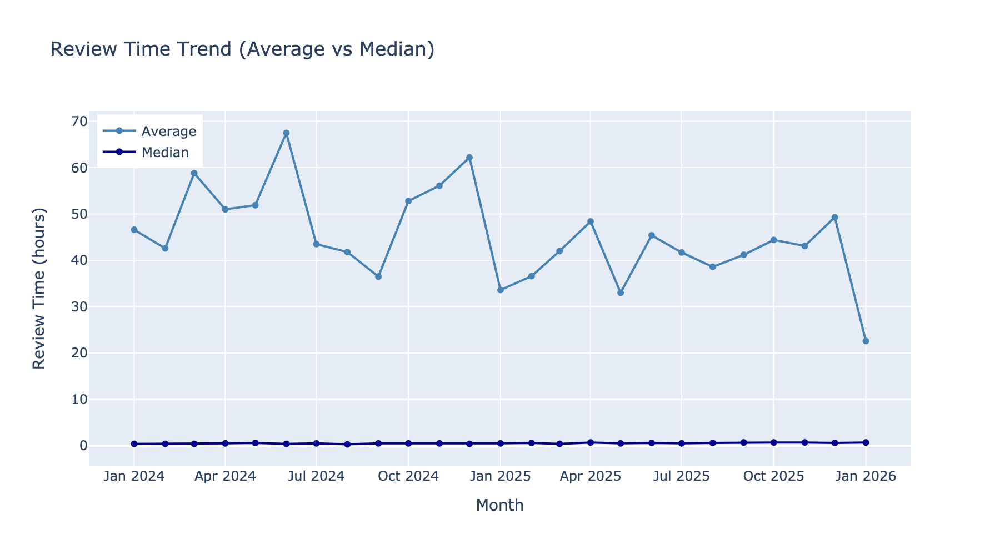

Average review time is ~40h (1.7 days), median is ~1 hour. Like cycle time, outliers pull up the average.

**Trend**: Review time has been declining over the past year. This may be related to AI-assisted review tools we've been investing in. Something we'll investigate further in the AI section.

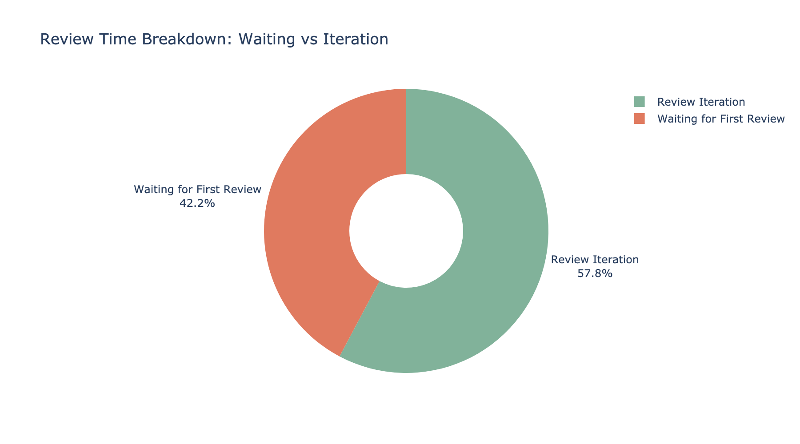

**Waiting vs Iteration**: Of the 40h average, 42% is waiting for first review (~17h) and 58% is review iteration (~23h). Review time isn't purely a "waiting" problem—most of it is legitimate back-and-forth.

**By Area**

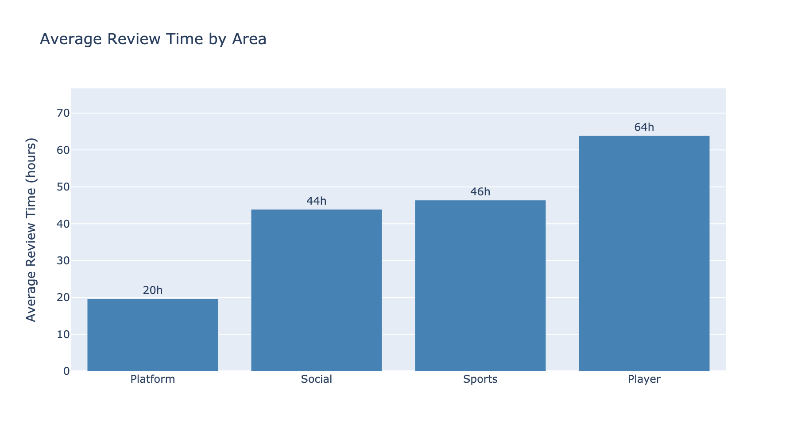

### Outlier Deep-Dive

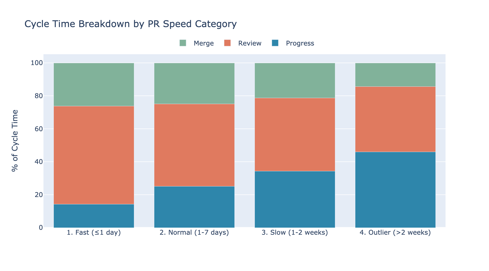

Fast PRs spend most of their time waiting for review (60%). Outliers spend most of their time in progress (coding phase) pre-review. This could be due to a large amount of work-in-progress.

*Todo: analyze and correlate work-in-progress*

*Todo: Deeper analysis to understand outlier patterns:* - *By team/area: Which teams have the highest outlier rates?* - *By work type: Are outliers features, refactors, migrations, or bug fixes?* - *By author tenure: Do new joiners create more outliers?* - *By repo/codebase: Are certain parts of the codebase prone to large PRs?* - *Cost analysis: How much eng-time is tied up in outliers?*

## PR Batch Size

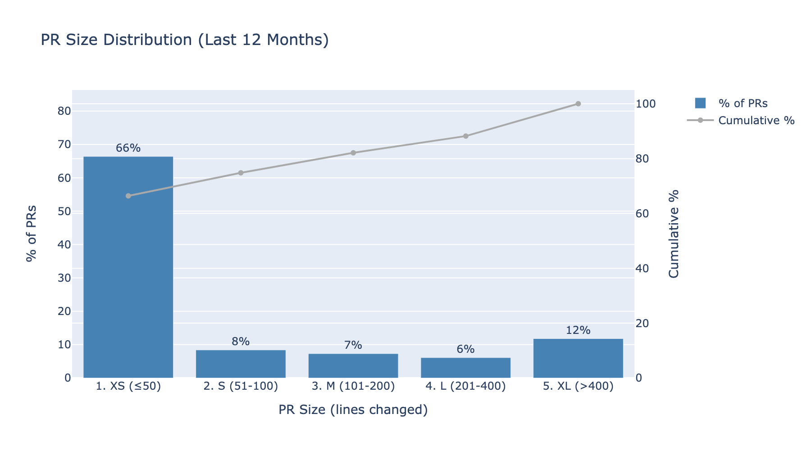

Two-thirds of PRs are small (≤50 lines). 12% are large (>400 lines).

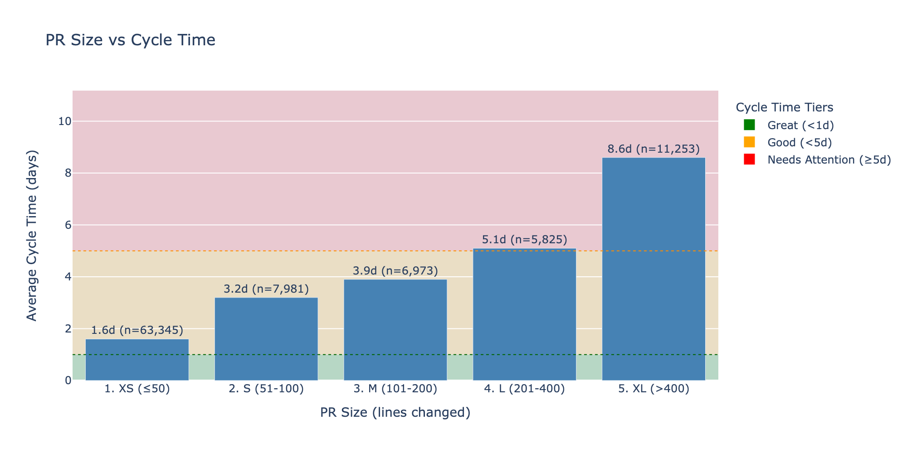

Larger PRs take longer: XL PRs (>400 lines) average 8.6 days vs 1.6 days for XS (≤50 lines).

### By Area

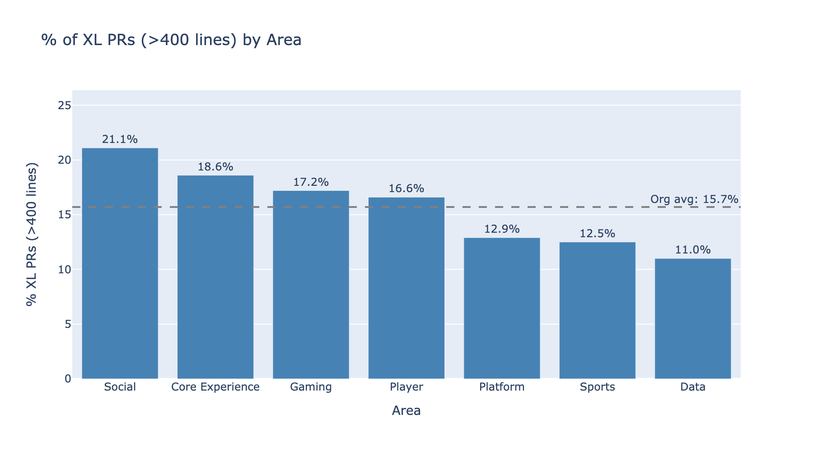

## Build Time and CI Feedback Speed

> If your CI pipeline takes 30 minutes and developers run it 5 times a day, that's 2.5 hours of waiting per person per day.

*Data not yet available.*

## Insights

1. **Most PRs are fast** - 74% merge within a day. The typical developer experience is quick iteration.
2. **5% of PRs account for most of the average cycle time** - Outliers (>2 weeks) pull the average from ~1 hour to ~3 days. Reducing outliers would have outsized impact.
3. **Outliers are stuck in progress, not review** - Fast PRs spend 60% of time in review. Outliers spend 46% in the coding phase itself. They're not waiting on reviewers—they're big, complex changes that take longer to build.
4. **PR size is the biggest lever** - XL PRs (>400 lines) take 5x longer than XS PRs (≤50 lines). Two-thirds of PRs are already small—the opportunity is converting the 12% that are XL.
5. **Review time is declining** - Review time has trended down over the past year, potentially related to AI-assisted review tools. We'll investigate further in the AI section.
6. **Significant variation across areas** - Player takes 3.5x longer than Data in review (63h vs 18h). Understanding what drives this gap could reveal improvement opportunities.

*Analysis: `notebooks/cycle_time.ipynb`*

# Software Delivery Performance

> DORA metrics provide the clearest picture of an organization's delivery capability and stability. This baseline covers **throughput** metrics (deployment frequency and time to deploy). Stability metrics (change fail rate, recovery time) are out of scope for this initial baseline.

## Areas Covered

This section covers **Player, Sports, Social, and Platform**, the four areas where we can reliably identify production deployments in Swarmia today.

| Area | What's Included |
| --- | --- |
| Player | Backend service deployments |
| Sports | Monorepo deployments (~70% of services) |
| Social | Backend production deployments |
| Platform | Monorepo deployments |

**Not included**: Core Experience, Data, and Gaming don't have consistent deployment tracking yet. They're included in PR-based metrics (throughput, cycle time) but excluded here. We're working on getting their deployment data and should have it soon.

## Deployment Frequency

> How often teams can ship to production. This is a proxy for delivery capability - elite teams can deploy whenever they need to.

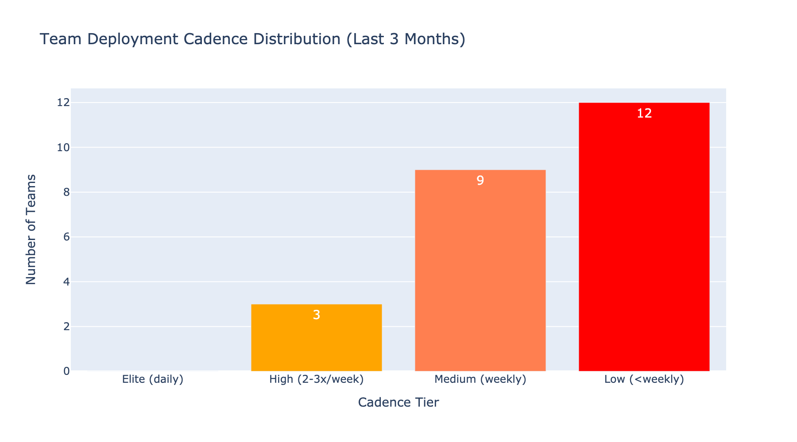

Most teams deploy weekly or less. No teams have achieved daily deployment capability yet, which is "Elite" according to the DORA industry benchmark.

### By Area

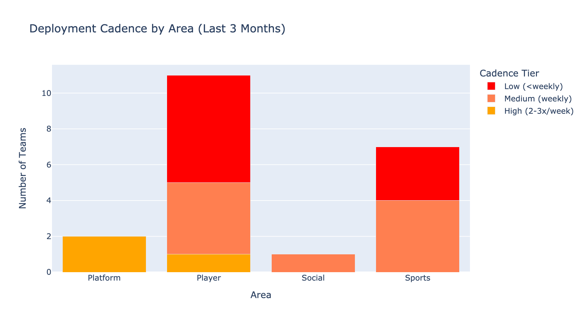

Deployment frequency varies significantly by area. Platform has the highest concentration of high-frequency deployers - this aligns with their faster Time to Deploy metrics (see below).

**Top performers**: Transact (deploy on 54% of days), Release Engineering (49%), App Frameworks (42%) - these teams can deploy 2-3x per week.

## Time to Deploy

> Time from **PR merged** to **deployed in production**. This measures deployment pipeline speed - how long does merged code wait before reaching users?

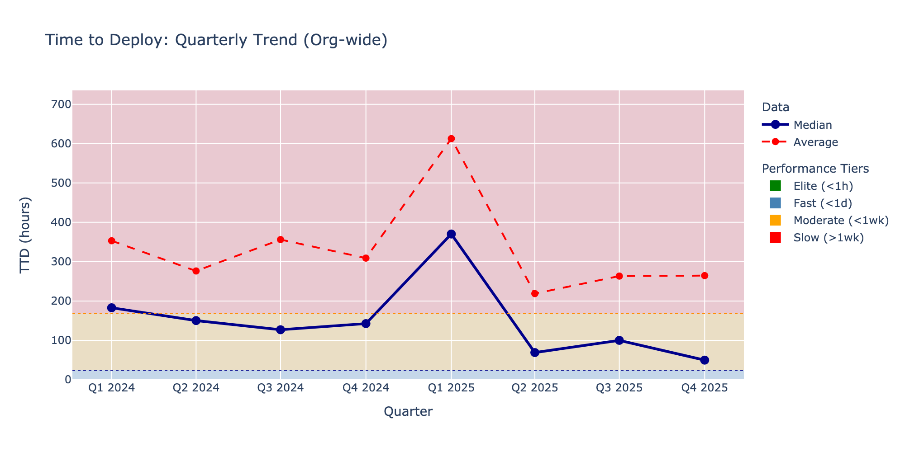

| Metric | 6-Month Baseline |
| --- | --- |
| Median TTD | 70h (2.9d) |
| Average TTD | 253h (10.6d) |
| P90 TTD | 579h (24d) |
| **Performance Tier** | **Moderate** |

Median TTD is ~3 days (Moderate tier). The average is 3.6x higher due to outliers - a small percentage of deployments take weeks.

### Distribution

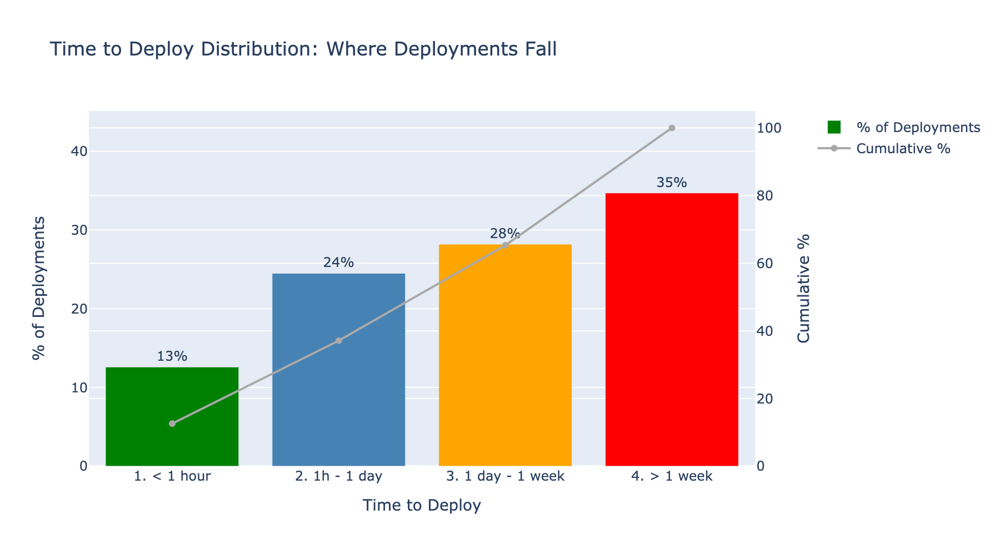

**37% of deployments ship within a day of merge.** The 35% taking over a week pull up the average significantly.

### By Area

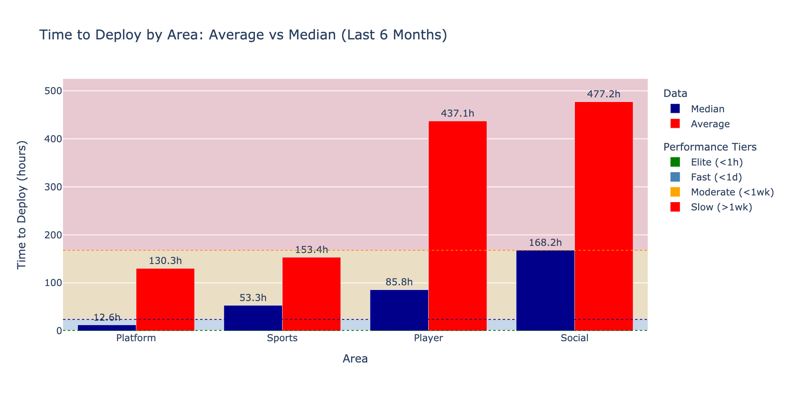

| Area | Median TTD | Tier | Gap to Next Tier |
| --- | --- | --- | --- |
| Platform | 12.6h | Fast | 11.6h to Elite |
| Sports | 53.3h (2.2d) | Moderate | 29.3h (1.2d) to Fast |
| Player | 85.8h (3.6d) | Moderate | 61.8h (2.6d) to Fast |
| Social | 168.2h (7.0d) | Slow | 0.2h to Moderate |

**Platform is the fastest** at 12.6h median - solidly in the Fast tier. **Social is the slowest** at 7 days - right at the Slow threshold.

### What Drives TTD?

| Factor | Finding |
| --- | --- |
| **Batch Size** | Bundling multiple PRs correlates with slower deploys |
| **Deployment Size** | Larger code changes take longer to deploy |

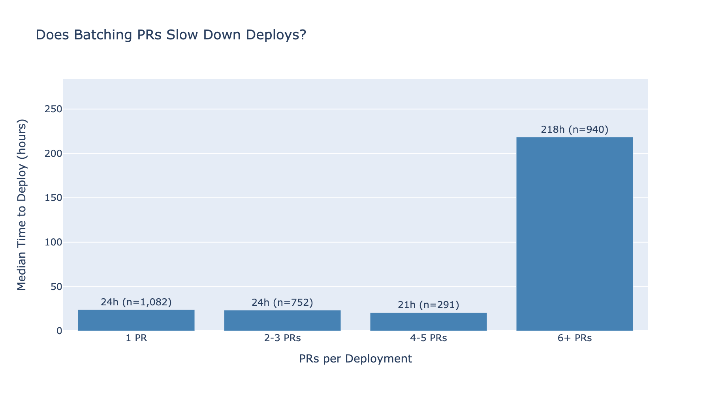

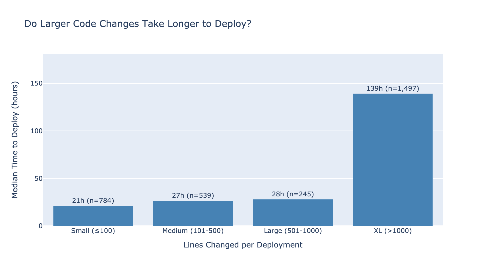

Most deployments are single-PR, and these deploy faster than multi-PR batches.

### By Change Type

> Do bug fixes deploy faster than new features? Understanding TTD by change type could reveal whether urgency or complexity drives deployment speed.

*TODO: Categorize deployments by type (bug fix, feature, refactor, etc.) if PR labels or commit conventions allow. Analyze TTD differences.*

### Insights

1. **No teams at elite cadence** - Even top performers deploy 2-3x/week, not daily. This suggests deployment processes still have friction.
2. **37% of deploys are fast, 35% are slow** - There's a bimodal distribution. Some pipelines work well; others have significant delays.
3. **Platform deploys fastest** - 13x difference in median TTD between fastest and slowest areas. Understanding what Platform does differently could benefit other areas.
4. **Smaller batches = faster deploys** - Single-PR deployments are faster.

### Out of Scope

The following stability metrics are not included in this baseline:
- **Change Fail Rate** - % of deployments causing incidents
- **Failed Deployment Recovery Time** - Time to recover from deployment failures
- **Deployment Rework Rate** - % of unplanned/reactive deployments

We're currently working on capturing this data and will add analysis in a future iteration.

*Analysis: `notebooks/software_delivery.ipynb`*

# Understanding Where Engineering Effort Goes

> These metrics help make informed decisions about resource allocation and have data-informed conversations about engineering capacity.

## Investment Balance

> The percentage of time spent on: new things, improvements, productivity, and keeping the lights on.
>
> **What it tells you**: Without visibility here, you'll assume most engineering time goes toward building new things. The reality is often different - many teams spend 40-50% on maintenance and unplanned work. If your roadmap assumes 80% feature capacity and reality is 50%, you'll keep missing commitments.

> **WIP!**

- Baseline: % New features vs Improvements vs Maintenance vs Unplanned
- Comparison by Area/Tribe
- Trend over time
- Insights

## Planning Accuracy

> What teams planned to ship versus what actually shipped.
>
> **What it tells you**: Matters at scale when predictability becomes important for coordinating across teams. Consistently low accuracy suggests problems with estimation, scope creep, or interruptions. Consistently high accuracy might mean teams are being too conservative.

> **WIP!**

- Baseline & Trend
- Comparison (Area/Tribe/Squad)
- Insights

# Developer Experience

> Numbers tell you what's happening, but not why. Developer experience directly impacts both productivity and retention.

> **WIP!**

- Survey results (if available)
- Key themes
- Comparison by Area/Tribe

# Measuring the Impact of AI Coding Tools

> If teams are using AI coding assistants, resist the urge to find a single "AI productivity KPI." What works better is examining existing metrics with an AI lens.
>
> **Important caveat**: If AI-assisted PRs have shorter cycle times, that might mean AI genuinely helps, OR your most experienced engineers are the keenest adopters, OR teams with strong fundamentals are both faster and more likely to experiment. Each explanation suggests different actions.

> **WIP** - currently collecting hypotheses to test.

### Output — Are AI adopters producing more?

Metrics: PR throughput, lines of code, batch size

Hypotheses:

- AI adopters have higher PR throughput (PRs/month per author)
- Deeper adoption = more output (Explorer → Baseline → Advanced progression)
- Did these cohorts already differ before AI tools? (self-selection control)
- Is the proportion of employees merging code increasing over time?
- Non-traditional contributors (product, design) starting to ship PRs
- PR throughput vs commits — are people pushing more directly with AI?
- Can we service more demand with the same team size?
- Step-change in output after model upgrades or workshops

### Efficiency — Are AI adopters faster?

Metrics: cycle time (total + progress/review/merge phases), time to first review

Hypotheses:

- AI adopters have shorter cycle times
- The pattern holds when controlling for PR size (isolate AI effect from "bigger PRs take longer")
- AI speeds up coding but creates a review bottleneck — review phase grows as a proportion of cycle time
- Some areas benefit more than others
- Workshop effect — do we see efficiency gains after workshops?
- Step-change in cycle time after model upgrades

### Quality — Is quality holding up?

Metrics: change failure rate, revert rate, MTTR, batch size / WIP

Hypotheses:

- Throughput increase doesn't come at a quality cost
- AI adopters don't have higher change failure or revert rates
- PR size is growing — are we shipping bigger, riskier changes?
- Batch size and WIP aren't increasing (i.e. we're not just piling up more in-flight work)

### Bot Review Impact — Do AI review bots improve outcomes?

Metrics: time to first human review, human review rounds, total review time, revert rate

Hypotheses:

- Bot-reviewed PRs have shorter time to first human review
- Bot-reviewed PRs have fewer human review rounds
- Bot-reviewed PRs have shorter total review time
- Bot-reviewed PRs are reverted less often
- Cursor Bug Bot vs PR Review Bot — one is more effective than the other
- Issues caught: bot vs human

### Workforce Dynamics — How is AI changing who contributes?

Metrics: contributor distribution (Gini coefficient), PR concentration, onboarding time

Hypotheses:

- Democratization vs amplification — are more people contributing meaningfully, or are top contributors just doing more?
- Key contributor dependency — is % of PRs from top 10% increasing or decreasing?
- Juniors producing at levels seniors did 2 years ago
- Seniority patterns — seniors are either skeptics or power users, tenure affects adoption
- People onboarding faster with AI (onboarding survey?)
- Usage retention — are people still dropping off or does adoption stick now?

### Events & Adoption Trends

Cross-cutting hypotheses about specific interventions and adoption patterns.

- Model upgrades (e.g. Opus 4.5) → step change in both adoption and productivity
- Workshop effect — adoption and productivity lift after workshops
- Supported Claude rollout vs previous shadow AI on fragmented tools — does stickiness improve?
- Usage retention over time — early drop-off patterns resolving?

### Cost & ROI *(future)*

- AI spend per developer
- Spend per hour of review time saved
- Agent hourly rate (human equivalent hours / AI spend)
- Net time gain per developer

# Comparative Scorecard

> Summary view across organizational units.

- Area-by-area summary table
- Tribe-by-tribe summary table
- Pain points by team
- Top performers

# Recommendations

*Todo: add recommendations by area.*

# Next Steps

1. **Complete deployment tracking** — Add Core Experience, Data, and Gaming to DORA metrics for fuller coverage.
2. **Integrate qualitative input** — Incorporate existing qualitative data into this report and run a developer survey to understand root causes behind the numbers.
3. **Build dashboards** — Create self-serve dashboards mirroring this report's structure, allowing teams and leaders to track trends, filter by Area/Tribe/Squad, and compare against this baseline.

# Appendix

- Notebooks
    - https://github.com/superbet-group/productivity-report
- Data definitions
- Methodology details
