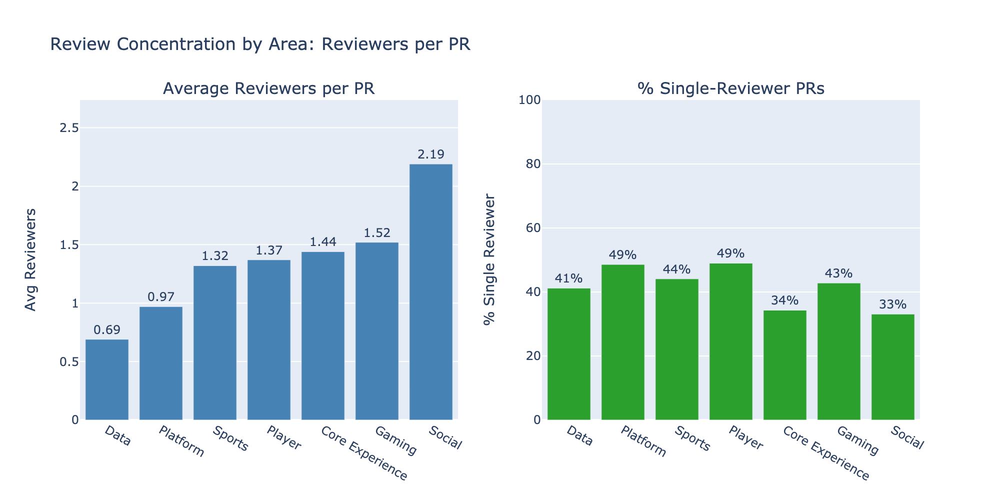
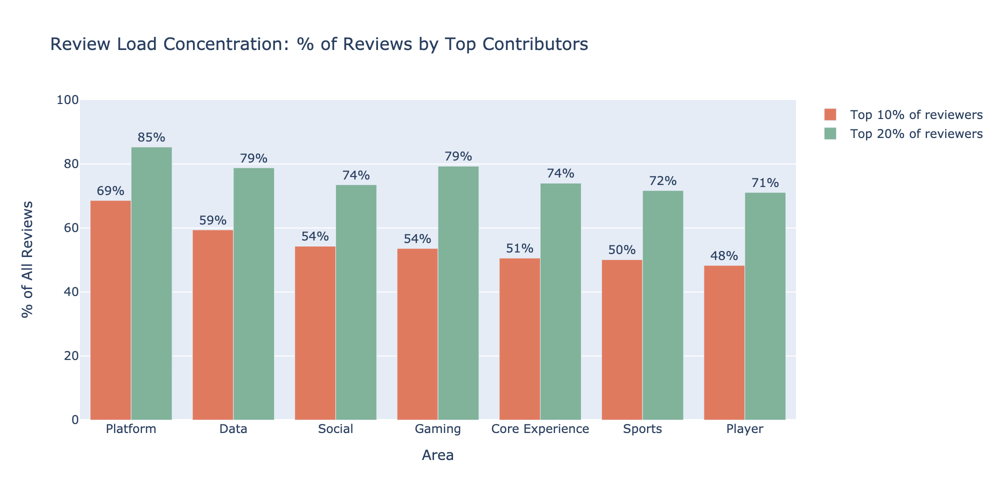
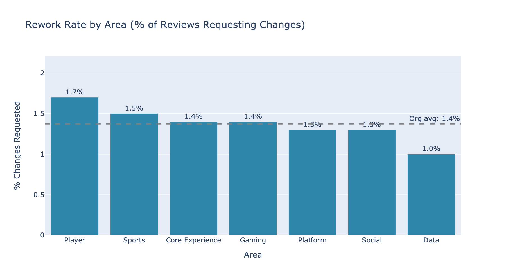
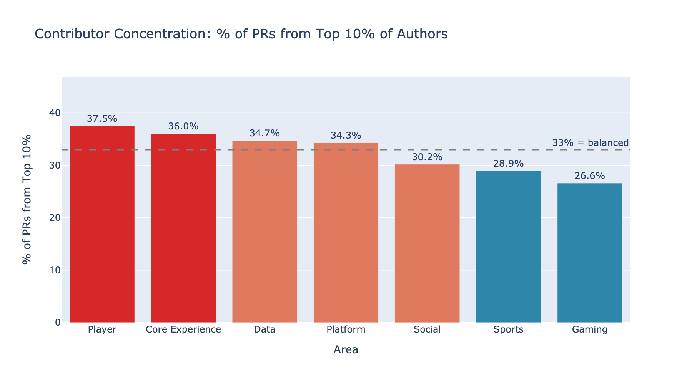
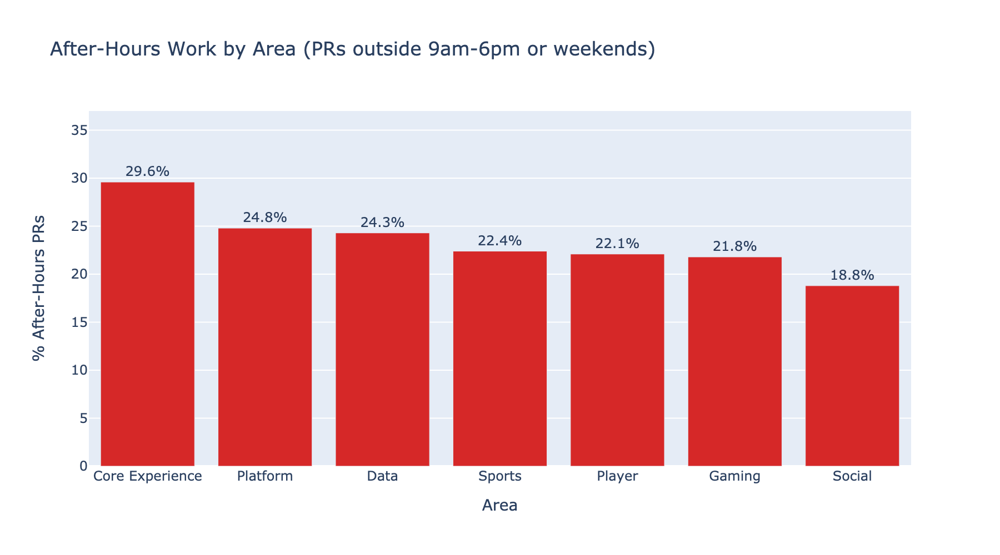
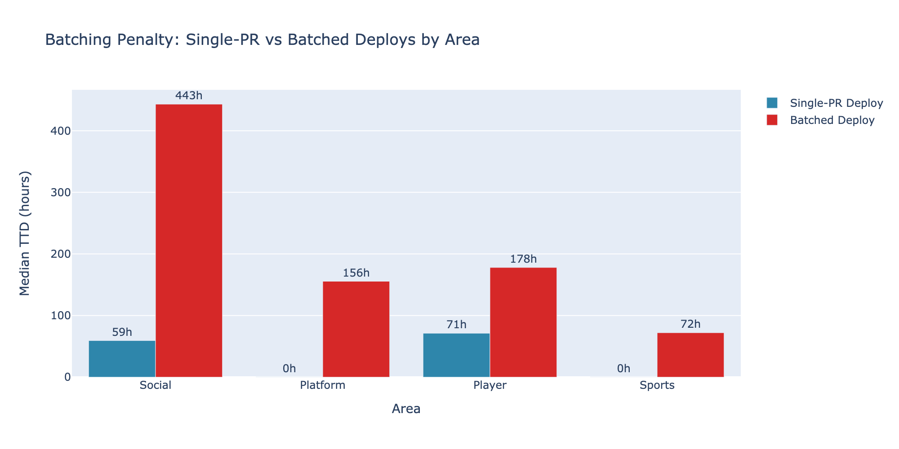
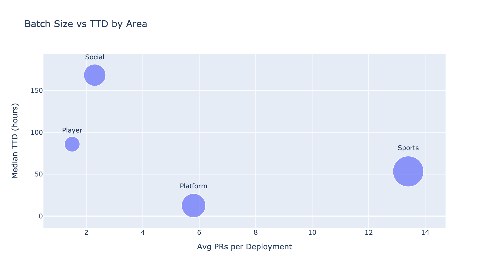

# Baseline System Productivity Report

## Executive Summary

*Work in progress*

## Introduction & Methodology

### Purpose

- Understand how to measure engineering productivity
- Establish a productivity baseline
- Enable future ROI evaluation of investments (AI adoption, hiring, etc.)

### Scope

- Areas/Tribes/Squads covered
- Time period

### Metrics Philosophy

This report uses metrics *about* teams rather than metrics *for* teams.

**Metrics for teams** are used by teams themselves to improve - they show up in retrospectives, inform working agreements, and help teams spot their own bottlenecks.

**Metrics about teams** give engineering leaders organizational visibility. They work best in aggregate, showing patterns across multiple teams or tracking progress on company-level goals.

This report focuses on the latter. The goal is transparency about organizational health, not surveillance of individuals or teams.

### Data Sources

- Swarmia
- [Others TBD]

## PR Throughput

> A high-level proxy for engineering output volume.

### Raw vs Normalized Throughput

**Key takeaway**: Raw throughput has nearly doubled in 2 years, but per-contributor throughput is flat. Growth is from hiring, not increased individual productivity.

| Metric | Jan 2024 | Jan 2025 | Jan 2026 | YoY Change |
|--------|----------|----------|----------|------------|
| PRs merged | 5,679 | 8,171 | 10,076 | +23% |
| Contributors | ~300 | ~415 | 564 | +36% |
| PRs/contributor | ~19 | ~20 | ~18 | -13% |

### Comparison by Area

Throughput per contributor varies by area due to various reasons including nature of work and domain.

*Note: Shows average monthly PRs per contributor over the last 6 months. Error bars show month-to-month variation (standard deviation).*

### Insights

1. **Growth is from hiring** - We're shipping more because we have more people, not because individuals are faster.

2. **AI impact not visible here** - Despite AI adoption, per-person throughput hasn't increased. Value may show up elsewhere (cycle time, code quality, onboarding).

3. **Questions for further investigation**:
   - Are PRs getting larger (more code per PR)?
   - Is cycle time improving?
   - Where is AI-saved time being reallocated?

### Throughput vs Batch Size

> Do areas with lower throughput ship larger PRs? If so, comparing raw PR counts may be misleading.

*TODO: Correlate PRs/contributor with average PR size by area. Some areas may ship fewer but larger changes.*

*Analysis: `notebooks/pr_throughput.ipynb`*

## Understanding Where Work Gets Stuck

### Cycle Time

> The total time a pull request spends in all stages of the development pipeline. Similar to change lead time but doesn't include time to deploy.

Cycle time is the sum of three components:

- **Time in progress** — from the first commit (or PR opened) to the first review request
- **Time in review** — from the first review request to final approval
- **Time to merge** — from final approval to merged

### 12-Month Baseline

*Benchmarks: Great < 24 hours, Good < 5 days, Needs Attention ≥ 5 days*

| Metric | Value | Benchmark |
|--------|-------|-----------|
| Average cycle time | 2.9 days | Good |
| Median cycle time | ~1 hour | Great |

Average cycle time is ~3 days, but median is under 1 hour. The typical PR (median) is in the "Great" tier—but outliers pull the average down to "Good".

| Speed Category | % of PRs | Avg Cycle Time |
|----------------|----------|----------------|
| Fast (≤1 day) | 74% | 3 hours |
| Normal (1-7 days) | 17% | 3.3 days |
| Slow (1-2 weeks) | 4% | 10 days |
| Outlier (>2 weeks) | 5% | 37 days |

Most PRs (74%) merge within a day—that's the typical developer experience. The 5% that take >2 weeks are the outliers pulling the average up from ~1 hour to ~3 days.

### Trend

Cycle time has remained stable despite the team nearly doubling in 2 years. We've scaled without slowing down.

### Cycle Time Breakdown

> Breaking cycle time into stages reveals exactly where work gets stuck.

| Phase | Average Hours | % of Total |
|-------|---------------|------------|
| Progress (coding) | 31h (1.3d) | 37% |
| Review | 40h (1.7d) | 47% |
| Merge | 14h | 17% |
| **Total** | **85h (3.5d)** | 100% |

**Key insight**: Review is the biggest phase at 47% of cycle time. This includes both waiting time (for first review, for re-reviews) and actual review work. Given that time to first review alone averages 17 hours, a significant portion of this phase is waiting, not active feedback.

### Review Time Deep Dive

Average review time is ~40h (1.7 days), median is ~1 hour. Like cycle time, outliers pull up the average.

**Trend**: Review time has been declining over the past year. This may be related to AI-assisted review tools we've been investing in—we'll investigate further in the AI section.

**Waiting vs Iteration**: Of the 40h average, 42% is waiting for first review (~17h) and 58% is review iteration (~23h). Review time isn't purely a "waiting" problem—most of it is legitimate back-and-forth.

#### By Area

#### Reviewer Count by Area

Areas with more reviewers per PR tend to have longer review times. Data and Platform have the highest rate of single-reviewer PRs (~85% and ~73% respectively), while Social requires an average of 2.4 reviewers per PR.

| Area | Avg Reviewers | % Single-Reviewer |
|------|---------------|-------------------|
| Data | 1.2 | 85% |
| Platform | 1.5 | 73% |
| Sports | 1.8 | 47% |
| Player | 2.0 | 40% |
| Social | 2.4 | 31% |

### Outlier Deep Dive

Outliers aren't stuck in review—they're stuck in progress. Fast PRs spend most of their time waiting for review (60%). Outliers spend nearly half their time in the coding phase itself (46%).

#### Understanding Outliers Better

> We know outliers are bigger PRs stuck in progress. But why are they big? What can we do about it?

*TODO: Deeper analysis to understand outlier patterns:*
- *By team/area: Which teams have the highest outlier rates?*
- *By work type: Are outliers features, refactors, migrations, or bug fixes?*
- *By author tenure: Do new joiners create more outliers?*
- *By repo/codebase: Are certain parts of the codebase prone to large PRs?*
- *Cost analysis: How much eng-time is tied up in outliers?*

### Batch Size (PR Size)

Two-thirds of PRs are small (≤50 lines). 12% are large (>400 lines).

Larger PRs take longer—XL PRs (>400 lines) average 8.6 days vs 1.6 days for XS (≤50 lines).

#### PR Size by Area

Areas vary significantly in their proportion of large PRs. Social has the highest rate of XL PRs (21%), while Data has the lowest (11%).

| Area | % XL PRs (>400 lines) |
|------|-----------------------|
| Social | 21% |
| Core Experience | 17% |
| Gaming | 13% |
| Player | 12% |
| Platform | 12% |
| Sports | 11% |
| Data | 11% |

### Build Time and CI Feedback Speed

> If your CI pipeline takes 30 minutes and developers run it 5 times a day, that's 2.5 hours of waiting per person per day.

*Data not yet available - requires CI/CD pipeline instrumentation.*

### Insights

1. **Most PRs are fast** - 74% merge within a day. The typical developer experience is quick iteration.

2. **5% of PRs account for most of the average cycle time** - Outliers (>2 weeks) pull the average from ~1 hour to ~3 days. Reducing outliers would have outsized impact.

3. **Outliers are stuck in progress, not review** - Fast PRs spend 60% of time in review. Outliers spend 46% in the coding phase itself. They're not waiting on reviewers—they're big, complex changes that take longer to build.

4. **PR size is the biggest lever** - XL PRs (>400 lines) take 5x longer than XS PRs (≤50 lines). Two-thirds of PRs are already small—the opportunity is converting the 12% that are XL.

5. **Review time is declining** - Review time has trended down over the past year, potentially related to AI-assisted review tools. We'll investigate further in the AI section.

6. **Significant variation across areas** - Player takes 3.5x longer than Data in review (63h vs 18h). Understanding what drives this gap could reveal improvement opportunities.

### Area-Specific Deep Dives

Six additional analyses to surface area-specific patterns and actionable recommendations.

#### Review Load Concentration

> Are a few people doing most of the reviews?

| Area | Top 10% Do | Top 20% Do |
|------|-----------|-----------|
| Platform | 69% | 82% |
| Data | 59% | 75% |
| Social | 54% | 71% |
| Gaming | 54% | 72% |
| Core Experience | 51% | 67% |
| Sports | 50% | 67% |
| Player | 48% | 65% |

**Key insight**: Platform has the most concentrated review load — top 10% handle 69% of reviews. This creates bottleneck risk if key reviewers are unavailable. Player has the most distributed review load (48%), which is healthier for resilience.

#### Rework Rate by Area

> How often do reviews request changes?

| Area | Rework Rate |
|------|-------------|
| Social | 4.2% |
| Player | 3.9% |
| Sports | 3.7% |
| Core Experience | 3.4% |
| Gaming | 2.8% |
| Platform | 2.1% |
| Data | 1.6% |

Overall rework rates are low (sub-5%), indicating good first-submission quality. Social and Player have the highest rates, which may partly explain their longer review iteration times.

#### Contributor Concentration (Bus Factor)

> What % of PRs come from the top 10% of contributors?

| Area | Top 10% Produce |
|------|-----------------|
| Player | 37.5% |
| Core Experience | 36.0% |
| Data | 34.7% |
| Platform | 34.3% |
| Social | 30.2% |
| Sports | 28.9% |
| Gaming | 26.6% |

**Key insight**: Player has the highest contributor concentration — top 10% produce 37.5% of PRs. This creates bus factor risk. Gaming is the most distributed at 26.6%.

#### After-Hours Work

> PRs created before 9am, after 6pm, or on weekends.

| Area | After-Hours % |
|------|---------------|
| Platform | 17.0% |
| Core Experience | 15.1% |
| Data | 11.8% |
| Player | 9.8% |
| Sports | 8.6% |
| Gaming | 6.5% |
| Social | 4.8% |

Platform's 17% after-hours rate likely reflects timezone distribution rather than overwork. Social's 4.8% suggests the most contained working hours.

#### Cycle Time Trend by Area

> Is cycle time improving or degrading?

| Area | Annual Change |
|------|--------------|
| Social | +1.75 days (degrading) |
| Gaming | +1.47 days (degrading) |
| Sports | +0.84 days |
| Core Experience | +0.68 days |
| Platform | +0.02 days (flat) |
| Data | -0.02 days (flat) |
| Player | -0.13 days (improving) |

**Key insight**: Social's cycle time is degrading the fastest (+1.75 days/year). Combined with its already-slow TTD, this requires attention. Player is the only area showing improvement (-0.13 days/year).

#### Batching Penalty by Area

> How much slower are batched (multi-PR) deployments?

| Area | Single-PR TTD | Batched TTD | Penalty |
|------|---------------|-------------|---------|
| Social | ~24h | ~408h | 384h |
| Platform | ~4h | ~160h | 156h |
| Player | ~43h | ~150h | 107h |
| Sports | ~36h | ~108h | 72h |

**Key insight**: Social pays the biggest batching penalty (384h gap). Sports has the smallest penalty (72h) despite having the highest batch rate — suggesting their batching is at least operationally efficient.

*Analysis: `notebooks/cycle_time.ipynb`, `notebooks/software_delivery.ipynb`*

## Software Delivery Performance

> DORA metrics provide the clearest picture of an organization's delivery capability and stability. This baseline covers **throughput** metrics (deployment frequency and time to deploy). Stability metrics (change fail rate, recovery time) are out of scope for this initial baseline.

### Areas Covered

This section covers **Player, Sports, Social, and Platform**, the four areas where we can reliably identify production deployments in Swarmia today.

| Area | What's Included |
|------|-----------------|
| Player | Backend service deployments |
| Sports | Monorepo deployments (~70% of services) |
| Social | Backend production deployments |
| Platform | Monorepo deployments |

**Not included**: Core Experience, Data, and Gaming don't have consistent deployment tracking yet. They're included in PR-based metrics (throughput, cycle time) but excluded here. We're working on getting their deployment data and should have it soon.

### Deployment Frequency

> How often teams can ship to production. This is a proxy for delivery capability - elite teams can deploy whenever they need to.

**Key takeaway**: Most teams deploy weekly or less. No teams have achieved daily deployment capability yet.

Half of teams deploy less than weekly. No teams have achieved daily deployment capability yet, though 3 teams (12%) deploy 2-3x per week.

#### By Area

Deployment frequency varies significantly by area. Platform has the highest concentration of high-frequency deployers - this aligns with their faster Time to Deploy metrics.

*Based on teams in tracked areas (Player, Sports, Social, Platform) with ≥3 deploy days in last 3 months.*

**Top performers**: Transact (54%), Release Engineering (49%), App Frameworks (42%) - these teams can deploy 2-3x per week.

### Time to Deploy

> Time from **PR merged** to **deployed in production**. This measures deployment pipeline speed - how long does merged code wait before reaching users?

**Key takeaway**: Median TTD is ~3 days (Moderate tier). The average is 3.6x higher due to outliers - a small percentage of deployments take weeks.

| Metric | 6-Month Baseline |
|--------|------------------|
| Median TTD | 70h (2.9d) |
| Average TTD | 253h (10.6d) |
| P90 TTD | 579h (24d) |
| **Performance Tier** | **Moderate** |

*Using stricter DORA benchmarks: Elite <1h, Fast <1d, Moderate <1wk, Slow >1wk*

#### Distribution

| Tier | % of Deployments |
|------|------------------|
| Elite (<1 hour) | 13% |
| Fast (<1 day) | 25% |
| Moderate (<1 week) | 28% |
| Slow (>1 week) | 35% |

**37% of deployments ship within a day of merge.** The 35% taking over a week pull up the average significantly.

#### By Area

| Area | Median TTD | Tier | Gap to Next Tier |
|------|------------|------|------------------|
| Platform | 12.6h | Fast | 11.6h to Elite |
| Sports | 53.3h (2.2d) | Moderate | 29.3h (1.2d) to Fast |
| Player | 85.8h (3.6d) | Moderate | 61.8h (2.6d) to Fast |
| Social | 168.2h (7.0d) | Slow | 0.2h to Moderate |

**Platform is the fastest** at 12.6h median - solidly in the Fast tier. **Social is the slowest** at 7 days - right at the Slow threshold.

### What Drives TTD?

| Factor | Finding |
|--------|---------|
| **Batch Size** | Bundling multiple PRs correlates with slower deploys |
| **Deployment Size** | Larger code changes take longer to deploy |

Most deployments are single-PR, and these deploy faster than multi-PR batches.

#### By Area: What's Driving Each Area's TTD?

| Area | Avg PRs/Deploy | % Batched | Median TTD | Primary Driver |
|------|----------------|-----------|------------|----------------|
| Sports | 13.4 | 88% | 53h | High batching |
| Platform | 5.8 | 54% | 13h | — (already fast) |
| Social | 2.3 | 45% | 168h | Process friction (not batching) |
| Player | 1.5 | 22% | 86h | PR age, not batching |

**Key insight**: Batching doesn't fully explain TTD differences.
- **Sports** has the highest batching (13.4 PRs/deploy) but moderate TTD — batching is a lever to pull
- **Social** has low batching (2.3 PRs/deploy) but the worst TTD (168h) — the problem is deployment process friction, not batch size
- **Player** deploys mostly single PRs (22% batched) but still has 86h TTD — PRs wait a long time after merge

**Actionable recommendations**:
- **Sports VP**: Reduce batch sizes — 88% of deploys are batched. More frequent, smaller deploys would cut TTD significantly.
- **Social VP**: Investigate deployment process — low batching but worst TTD suggests manual gates, approval processes, or infrastructure issues.
- **Player VP**: Review deployment triggers — single-PR deploys waiting 86h suggests scheduled/manual releases rather than continuous deployment.

#### By Change Type

> Do bug fixes deploy faster than new features? Understanding TTD by change type could reveal whether urgency or complexity drives deployment speed.

*TODO: Categorize deployments by type (bug fix, feature, refactor, etc.) if PR labels or commit conventions allow. Analyze TTD differences.*

### Insights

1. **No teams at elite cadence** - Even top performers deploy 2-3x/week, not daily. This suggests deployment processes still have friction.

2. **37% of deploys are fast, 35% are slow** - There's a bimodal distribution. Some pipelines work well; others have significant delays.

3. **Platform deploys fastest** - 13x difference in median TTD between fastest and slowest areas. Understanding what Platform does differently could benefit other areas.

4. **Smaller batches = faster deploys** - Single-PR deployments are faster.

5. **Gap to next tier is achievable** - Most areas need to shave 1-3 days off median TTD to reach the next performance tier.

### Out of Scope

The following stability metrics are not included in this baseline:
- **Change Fail Rate** - % of deployments causing incidents
- **Failed Deployment Recovery Time** - Time to recover from deployment failures
- **Deployment Rework Rate** - % of unplanned/reactive deployments

We're currently working on capturing this data and will add analysis in a future iteration.

*Analysis: `notebooks/software_delivery.ipynb`*

## Understanding Where Engineering Effort Goes

> These metrics help make informed decisions about resource allocation and have data-informed conversations about engineering capacity.

### Investment Balance

> The percentage of time spent on: new things, improvements, productivity, and keeping the lights on.
>
> **What it tells you**: Without visibility here, you'll assume most engineering time goes toward building new things. The reality is often different - many teams spend 40-50% on maintenance and unplanned work. If your roadmap assumes 80% feature capacity and reality is 50%, you'll keep missing commitments.

- Baseline: % New features vs Improvements vs Maintenance vs Unplanned
- Comparison by Area/Tribe
- Trend over time
- Insights

### Planning Accuracy

> What teams planned to ship versus what actually shipped.
>
> **What it tells you**: Matters at scale when predictability becomes important for coordinating across teams. Consistently low accuracy suggests problems with estimation, scope creep, or interruptions. Consistently high accuracy might mean teams are being too conservative.

- Baseline & Trend
- Comparison (Area/Tribe/Squad)
- Insights

## Developer Experience

> Numbers tell you what's happening, but not why. Developer experience directly impacts both productivity and retention.

- Survey results (if available)
- Key themes
- Comparison by Area/Tribe

## Measuring the Impact of AI Coding Tools

> If teams are using AI coding assistants, resist the urge to find a single "AI productivity KPI." What works better is examining existing metrics with an AI lens.
>
> **Important caveat**: If AI-assisted PRs have shorter cycle times, that might mean AI genuinely helps, OR your most experienced engineers are the keenest adopters, OR teams with strong fundamentals are both faster and more likely to experiment. Each explanation suggests different actions.

- Adoption rates by Area/Tribe/Squad
- Adoption overlays
- Metrics comparison: AI-assisted vs non-AI-assisted
  - Cycle time
  - Batch size
  - Time in review
- Survey results (CSAT, self reported time savings, time saved on non-dev tasks, friction)
- Key findings (with appropriate caveats)
- Hypotheses to test
    - Major model improvements lead to step-change improvements (e.g. Opus 4.5)
        - More adoption
        - More productivity
    - Broad, supported adoption on Claude (vs before: shadow AI on fragmented, less capable tools)
    - Impact of workshops on adoption & productivity
        - More adoption after workshops
        - People in workshops have higher throughput? ("workshop effect")
    - Correlating throughput with AI adoption
    - No longer have this effect where people try and stop using (usage sticks)
    - Product is starting to write more code
    - Is the proportion of employees merging code increasing with AI?
    - Throughput is dramatically increasing (throughput with AI adoption overlay)
    - People are onboarding faster(?) -> not sure how to measure.. Onboarding survey?
    - We can service more demand (e.g. investment balances)
    - We are not paying a big quality price (review time, batch size, WIP)
    - PR throughput vs commits - are we pushing more directly?
    - How does PR throughput compare to batch sizes
    - Are we becoming more or less dependent on key contributors?
        - Is AI: democratizing output (more people contributing meaningfully) *or* amplifying existing patterns (top contributors just do even more)
        - Gini coefficient of PR distribution or % of PRs from top 10% contributors over time
    - Show cost: spending X amount per hour saved on review time

## Comparative Scorecard

> Summary view across organizational units.

### Area Overview

At-a-glance comparison of each area's performance across key metrics.

*Periods: PRs/Contributor (6 months) · Cycle Time, Review Time (12 months) · Time to Deploy (6 months) · Deploy Freq (3 months)*

| Area | PRs/Contributor | Cycle Time | Review Time | Time to Deploy | Deploy Freq |
|------|-----------------|------------|-------------|----------------|-------------|
| **Platform** | 10.5 | 🟡 1.6d | 🟢 19h | 🟢 12.6h | 🟢 Highest |
| **Data** | 10.7 | 🟡 1.5d | 🟢 19h | — | — |
| **Core Experience** | 13.6 | 🟡 2.3d | 🟡 25h | — | — |
| **Sports** | 10.5 | 🟡 3.5d | 🟡 47h | 🟡 2.2d | 🟡 |
| **Gaming** | 9.8 | 🟡 3.5d | 🟡 32h | — | — |
| **Social** | 7.4 | 🟡 4.1d | 🟡 44h | 🔴 7.0d | 🟡 |
| **Player** | 5.9 | 🔴 5.3d | 🔴 64h | 🟡 3.6d | 🟡 |

*🟢 Great | 🟡 Good | 🔴 Needs attention | — No deployment data*

**Thresholds**: Cycle Time (🟢 <1d, 🟡 1-5d, 🔴 ≥5d) · Review Time (🟢 <24h, 🟡 24-48h, 🔴 ≥48h) · TTD (🟢 <1d, 🟡 <1wk, 🔴 ≥1wk)

### Observations

1. **Platform and Data are consistently strong** — Both areas are green on review time and lead on cycle time. Understanding their practices could benefit other areas.

2. **Throughput varies by domain** — Ranges from 5.9 to 13.6 PRs/contributor/month.

3. **3.5x variation in review time** — Ranges from 19h (Data, Platform) to 64h (Player). This gap suggests opportunity for cross-area learning.

4. **TTD and dev metrics don't always correlate** — Slow deployments can exist alongside healthy cycle times, suggesting pipeline friction rather than development issues.

5. **Core Experience, Data, Gaming missing deployment data** — Tracking not yet configured for these areas.

### Top Performers

| Metric | Leader | Value |
|--------|--------|-------|
| Fastest Cycle Time | Data | 1.5 days |
| Fastest Review Time | Data, Platform | 19h |
| Fastest Time to Deploy | Platform | 12.6h |
| Highest Deploy Frequency | Transact, Release Engineering, App Frameworks | 2-3x/week |

## Recommendations by Area

> Synthesized insights for each area, combining PR metrics, cycle time, review patterns, and deployment data.

### Player

**Status**: 🔴 Needs attention on cycle time and review time

| Metric | Value | vs Org Avg |
|--------|-------|-----------|
| Cycle Time | 5.3 days | 1.8x slower |
| Review Time | 64h | 1.6x slower |
| Outlier Rate | 9.4% | Highest |
| Review Iteration | 51h | Highest |
| Contributor Concentration | 37.5% from top 10% | Highest (bus factor risk) |
| Rework Rate | 3.9% | Above average |
| Cycle Time Trend | -0.13 days/year | Slightly improving |

**Key bottleneck**: Review iteration time (51h) — far higher than the org average (23h). Combined with the highest outlier rate (9.4%) and highest contributor concentration (37.5%), PRs get stuck in extended back-and-forth while output depends heavily on a few people.

**Positive signal**: Player is the only area where cycle time is improving (-0.13 days/year).

**Recommendations**:
1. **Break down large PRs** — Player's outlier rate suggests large, complex changes. Encourage incremental PRs.
2. **Investigate review iteration** — Why does review take 2x longer than other areas? Are requirements unclear? Codebase complexity?
3. **Reduce contributor concentration** — Top 10% produce 37.5% of PRs. Pair programming, mentoring, or rotating ownership could distribute knowledge.
4. **Learn from Platform/Data** — Both have review times under 20h. What review practices differ?

---

### Social

**Status**: 🔴 Needs attention on TTD and cycle time trend

| Metric | Value | vs Org Avg |
|--------|-------|-----------|
| Time to Deploy | 7.0 days | Slowest |
| % XL PRs | 21% | Highest |
| Avg Reviewers | 2.4 | Most reviewers required |
| PR Age at Deploy | 275h | Longest wait |
| Rework Rate | 4.2% | Highest |
| Batching Penalty | 384h gap | Largest |
| Cycle Time Trend | +1.75 days/year | Fastest degradation |

**Key bottleneck**: Deployment pipeline latency — PRs wait 275h (11+ days) from merge to deploy. Social also has the highest rework rate (4.2%), the biggest batching penalty (384h), and the fastest-degrading cycle time (+1.75 days/year). This is the area most urgently needing process intervention.

**Recommendations**:
1. **Investigate deployment process urgently** — 7-day TTD with low batching (2.3 PRs/deploy) points to process friction, not batch size. Manual gates? Approval processes? Infrastructure issues?
2. **Break up XL PRs** — 21% XL rate is nearly 2x the org average. Smaller PRs = faster reviews, faster deploys.
3. **Address rework rate** — 4.2% is the highest. Clearer requirements or design reviews before implementation could reduce review iteration.
4. **Arrest cycle time degradation** — At +1.75 days/year, Social's cycle time is worsening fastest. Root-cause analysis needed.

---

### Sports

**Status**: 🟡 Good across most metrics

| Metric | Value | vs Org Avg |
|--------|-------|-----------|
| Cycle Time | 3.5 days | Average |
| TTD | 2.2 days | Above average |
| Batch Size | 13.4 PRs/deploy | Highest |
| Time to First Review | 26h | Slowest |
| Batching Penalty | 72h gap | Smallest |
| Cycle Time Trend | +0.84 days/year | Slight degradation |

**Key opportunity**: Time to first review (26h) is the slowest in the org. Sports also has the highest deployment batching (13.4 PRs/deploy), but the smallest batching penalty (72h) — suggesting operationally efficient batched deploys.

**Recommendations**:
1. **Speed up first review** — 26h average time to first review vs 8h for Data. Consider review load balancing or async review practices.
2. **Reduce deployment batching** — 13.4 PRs per deployment is high. More frequent, smaller deploys would reduce TTD, and the small batching penalty means the transition should be smooth.
3. **Maintain current strengths** — Cycle time and PR size metrics are healthy; focus improvements on review wait time.

---

### Platform

**Status**: 🟢 Strong across all metrics

| Metric | Value | vs Org Avg |
|--------|-------|-----------|
| Time to Deploy | 12.6h | Fastest |
| Review Time | 18h | Top tier |
| Single-reviewer PRs | 73% | High efficiency |
| Deploy Frequency | Highest | Elite tier teams |
| Review Load Concentration | 69% by top 10% | Most concentrated |
| After-Hours Work | 17% | Highest |
| Cycle Time Trend | +0.02 days/year | Stable |

**What's working**: Platform has the fastest deployment pipeline and efficient single-reviewer PRs. Cycle time is stable year-over-year. They're the model for other areas.

**Watch items**: Review load is the most concentrated (69% by top 10%) — a few key reviewers are critical. After-hours rate (17%) is highest, likely reflecting timezone distribution but worth monitoring.

**Recommendations**:
1. **Document practices** — What enables 73% single-reviewer PRs and 12h TTD? Share patterns with other areas.
2. **Push for Elite TTD** — Gap to Elite tier (<1h) is 11.6h. Explore automated deployment triggers.
3. **Distribute review load** — Top 10% handle 69% of reviews. If key reviewers leave, review throughput would drop significantly.
4. **Continue investment** — Platform's infrastructure enables other teams; maintaining this edge benefits the org.

---

### Data

**Status**: 🟢 Strong on PR metrics (no deployment data)

| Metric | Value | vs Org Avg |
|--------|-------|-----------|
| Cycle Time | 1.5 days | Fastest |
| Review Time | 18h | Top tier |
| Single-reviewer PRs | 85% | Highest |
| Time to First Review | 7.6h | Fastest |
| Rework Rate | 1.6% | Lowest |
| Cycle Time Trend | -0.02 days/year | Stable |

**What's working**: Fastest time to first review (7.6h), highest single-reviewer rate (85%), and lowest rework rate (1.6%). Data teams have efficient, lightweight review processes with high first-submission quality. Cycle time is stable.

**Recommendations**:
1. **Add deployment tracking** — Data is missing from DORA metrics. Adding deployment filters would complete the picture.
2. **Share review practices** — 85% single-reviewer rate and 1.6% rework rate suggests clear ownership and quality standards. Document this pattern for other areas.

---

### Core Experience & Gaming

**Status**: 🟡 Good on PR metrics (no deployment data)

Both areas have reasonable cycle times (2.3d, 3.5d) but lack deployment tracking.

| Metric | Core Experience | Gaming |
|--------|-----------------|--------|
| Cycle Time Trend | +0.68 days/year | +1.47 days/year |
| Contributor Concentration | 36% from top 10% | 26.6% (most distributed) |
| After-Hours Work | 15.1% | 6.5% |

**Recommendations**:
1. **Add deployment tracking** — Required for complete DORA metrics.
2. **Core Experience**: Monitor 17% XL PR rate — second highest after Social. 15.1% after-hours rate is worth investigating.
3. **Gaming**: Cycle time degrading at +1.47 days/year (second fastest after Social). Monitor closely. Positively, Gaming has the most distributed contributor base (26.6%), indicating low bus factor risk.

---

### Cross-Area Patterns

| Finding | Areas Affected | Recommendation |
|---------|----------------|----------------|
| High outlier rates | Player (9.4%), Social (6.6%) | PR size limits, incremental delivery |
| Slow first review | Sports (26h), Player (18h) | Review load balancing |
| Multi-reviewer overhead | Social (2.4 avg), Player (2.0) | Clear ownership, reduce reviewer requirements |
| Deployment batching | Sports (13.4 PRs), Social (6.9 PRs) | More frequent, smaller deploys |
| Cycle time degradation | Social (+1.75d/yr), Gaming (+1.47d/yr) | Root-cause analysis, process review |
| Review load concentration | Platform (69%), Data (59%) | Distribute review ownership |
| Contributor concentration | Player (37.5%), Core Exp (36%) | Knowledge sharing, pair programming |
| High rework rate | Social (4.2%), Player (3.9%) | Clearer requirements, design reviews |

## Recommendations

*To be added — requires qualitative input to turn insights into actionable investment decisions.*

## Next Steps

1. **Complete deployment tracking** — Add Core Experience, Data, and Gaming to DORA metrics for fuller coverage.

2. **Build dashboards** — Create self-serve dashboards mirroring this report's structure, allowing teams and leaders to track trends, filter by Area/Tribe/Squad, and compare against this baseline.

3. **Integrate qualitative input** — Incorporate existing qualitative data into this report and run a developer survey to understand root causes behind the numbers.

## Appendix

- Data definitions
- Methodology details
